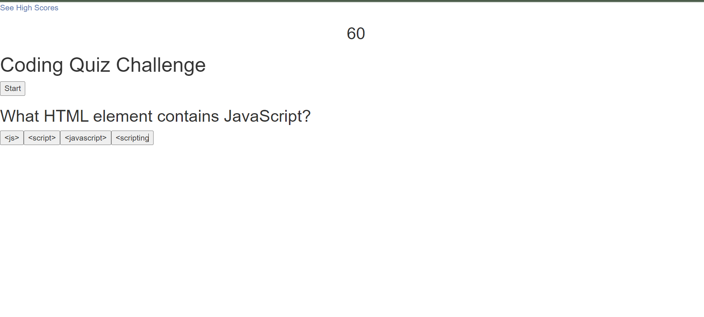

# Code Quiz

## Description
I built this project to have a way to test myself on different topics, including JavaScript and other languages I've been learning. 
I learned a lot about timing, and about the necessary syntax and language to make things happen correctly and consistently on my webpage using JavaScript.

## Table of Contents
- [Installation](#installation)
- [Usage](#usage)
- [Credits](#credits)

## Installation
Install the dependencies and open /index.html in the browser.

## Usage
Open the page, click the "Start" button, and click the correct answers.

 
## Credits
style.css file from: http://www.initializr.com/
